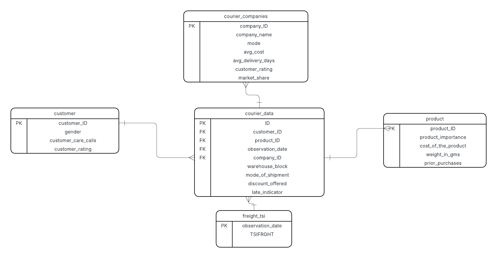

## Comparing Courier Service Performance in the U.S.

This project analyzes courier shipment data to evaluate delivery performance, customer sastifaction, and shipping companies.
the analysis uses **SQL and Python** to explore how shipping mode, cost, and company service quality relate to on-time performance.     

## Data Sources
1. **[Logistics Regression Analysis Dataset](https://www.kaggle.com/datasets/prachi13/customer-analytics)**  
   *Source:* Kaggle (by Prachi13, for educational use)  
   *Contains:* shipment-level data including mode of shipment, product cost, weight, customer rating, and delivery timeliness.

2. **[courier_companies.csv](data/courier_companies.csv)**  
   *Source:* Custom dataset created to simulate major U.S. courier companies such as FedEx, UPS, USPS, DHL, and Amazon Logistics.  
   *Contains:* company-level metrics including shipping mode, average cost, delivery days, customer rating, and market share.

3. **Freight_tsi.csv** - Freight Transportation Services Index from U.S. Bereau of Transportation Statistics  

   ### Why These Datasets Were Combined 

The goal of this project is to compare courier service performance in the U.S. across different shipping methods and companies.

By combining shipping-level data (from Kaggle) with company-level performance metrics 
(from the new courier_companies dataset), we can evaluate how cost, speed, and customer satisfaction vary between couriers and shipment modes.

This integrated design enables the analysis of logistics efficiency, competitiveness, and service quality across different courier companies and shipment modes.

// 


**Autor: **Prachi13 dataset available for educational purposes

## Database Schema 
The database was designed using SQLite to support relational analysis between shipments, products, customers, companies, and freight index trends.  
It contains **five normalized tables**: 'courier_data', 'customer', 'product', 'freight_tsi', and 'courier_companies'.


## table 1: courier_data (from Train.csv)
Column                 Description                  Type                      
----------------------------------------------------------------------------
 ID                   Shipment ID                   Integer (Primary Key)     
 observation_date     Shipment date                 Date (FK → freight_tsi)   
 customer_ID          Linked customer               Integer (FK → customer)   
 product_ID           Linked product                Integer (FK → product)    
 company_ID           Linked courier company        Integer (FK → courier_companies) 
 warehouse_block      Warehouse area                Text                      
 mode_of_shipment     Air, Ship, or Road            Text                      
 discount_offered     Discount percent              Integer                   
 late_indicator       1 = Late, 0 = On Time         Integer                   

## Table 2: customer
 Column               Description                 Type                      
----------------------------------------------------------------------------
customer_ID          Customer identifier         Integer (Primary Key)     
gender               Customer gender             Text                      
customer_care_calls  Number of calls made        Integer                   
customer_rating      Rating from 1–5             Integer                   

### Table 3: product
 Column               Description                 Type                      
---------------------------------------------------------------------------
 product_ID           Product identifier         Integer (Primary Key)     
 product_importance   Low / Medium / High         Text                      
 cost_of_the_product  Product cost                Integer                   
 weight_in_gms        Package weight (grams)      Integer                   
 prior_purchases      Previous purchases          Integer                   

### Table 4: freight_tsi (from freight_tsi.csv)
 Column               Description                 Type                      
---------------------------------------------------------------------------
 observation_date     Date of record              Date (Primary Key)        
 TSIFRGHT             Freight index value         Float / Real              

### Table 5: courier_companies (new dataset)
 Column               Description                   Type                      
----------------------------------------------------------------------------
 company_ID           Company identifier            Integer (Primary Key)     
 company_name         Courier company name (FedEx, UPS, USPS, DHL, Amazon Logistics, etc.) | Text 
 mode                 Dominant shipping mode      Text                      
 avg_cost             Average shipment cost          Integer                   
 avg_delivery_days    Average delivery time (days)   Float                   
 customer_rating      Average customer rating        Float                     
 market_share         Estimated market share (%)     Float                     

### Relationships
- courier_data.customer_ID → customer.customer_ID  
- courier_data.product_ID → product.product_ID  
- courier_data.observation_date → freight_tsi.observation_date  
- courier_data.company_ID → courier_companies.company_ID  

**One-to-many relationships** (each customer, product, date, or company can have many courier_data records).


## Relationship Between Tables
Connection: courier_Data.Date > freight_tsi.observation_date
Type: One-to-many (one TSI date applies to many courier shipments that day)


ERD
## Entity Relationship Diagram (ERD)



The updated ERD includes a new table, **courier_companies**, which represents major courier service providers such as UPS, FedEx, USPS, DHL, and Amazon Logistics.  
It connects to the **courier_data** table through the 'company_ID' field, allowing comparisons of cost, delivery performance, and customer ratings across multiple courier companies.

```mermaid
erDiagram
    CUSTOMER ||--o{ COURIER_DATA : "customer_ID"
    PRODUCT  ||--o{ COURIER_DATA : "product_ID"
    COURIER_COMPANIES ||--o{ COURIER_DATA : "company_ID"
    FREIGHT_TSI ||--o{ COURIER_DATA : "Observation_date"

    CUSTOMER {
        INT customer_ID PK
        TEXT gender
        INT customer_care_calls
        INT customer_rating
    }

    PRODUCT {
        INT product_ID PK
        TEXT product_importance
        INT cost_of_the_product
        INT weight_in_gms
        INT prior_purchases
    }

    FREIGHT_TSI {
        DATE observation_date PK
        REAL TSIFRGHT
    }

    COURIER_COMPANIES {
        INT company_ID PK
        TEXT company_name
        TEXT mode
        INT avg_cost
        FLOAT avg_delivery_days
        FLOAT customer_rating
        FLOAT market_share
    }

    COURIER_DATA {
        INT ID PK
        DATE observation_date FK
        INT customer_ID FK
        INT product_ID FK
        INT company_ID FK
        TEXT warehouse_block
        TEXT mode_of_shipment
        INT discount_offered
        INT late_indicator
    }

## Key Steps 
1. Loaded and cleaned raw data in Python 
2. Build a normalized SQLite database with 4 releate tables 
3. Designed an ERD diagram
4. Ran SQL queries to compare efficiency and reliability 
5. Visualized performance trends in Python 
    
## Tools Used 
- Ptthon (Pandas, SQLite, Matphotlib, Seaborn)
-SQL
-Jupitor Notebook
-GitHub for version control 

## Author 
J. W. Blevins
